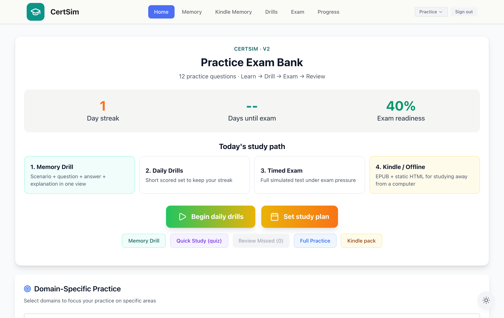
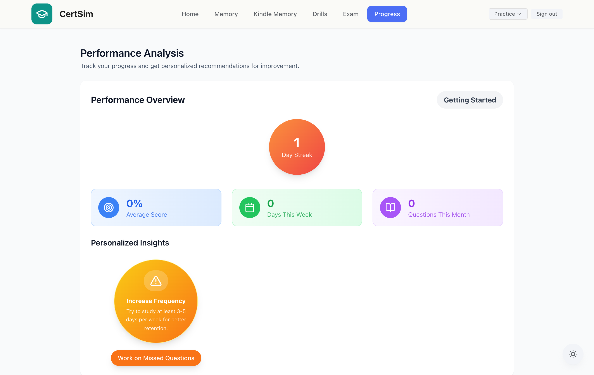
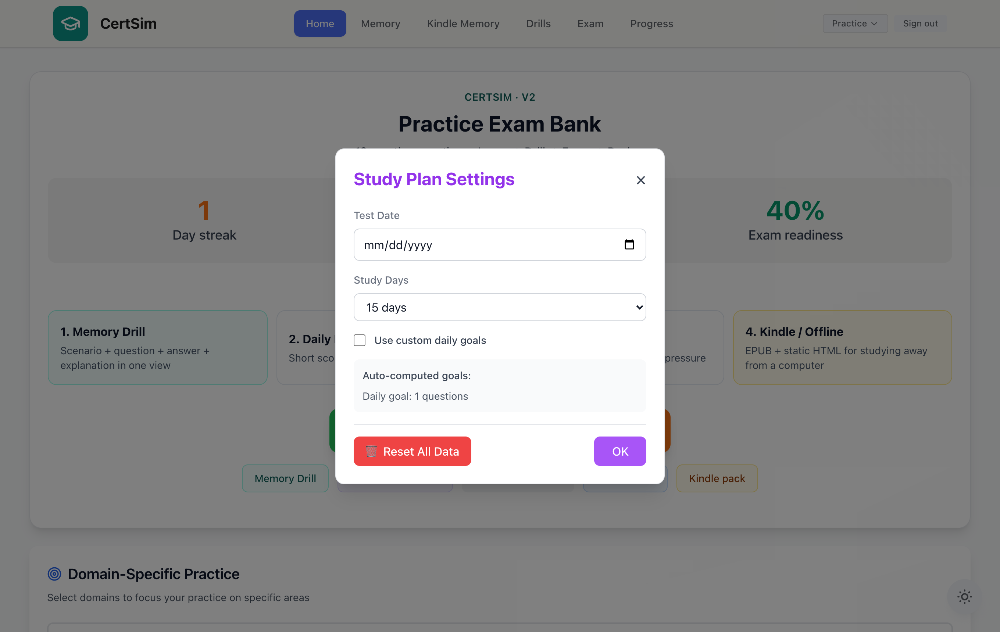
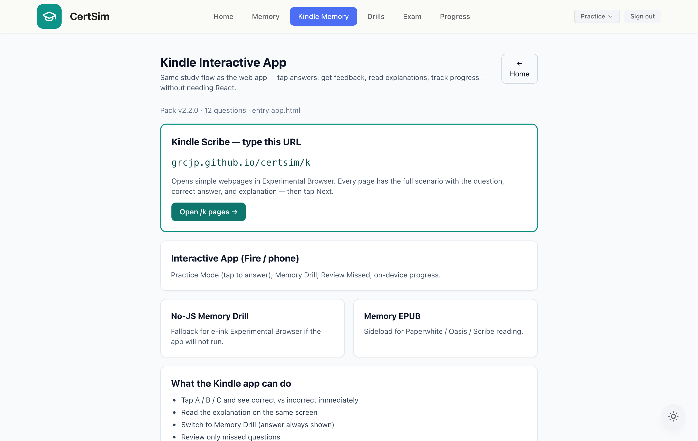

# CertSim

**A modular certification-exam simulator engine** — turn any content set into structured practice, adaptive scoring, spaced-repetition memory drills, per-domain reinforcement, timed exam simulations, and a fully offline Kindle study pack.

`React 19` · `Vite 7` · `Tailwind` · OAuth-style access gate · optional cloud sync · zero-runtime offline pack



> The point isn't any specific content — it's the **engine**. Everything is content-agnostic: point it at your own data file and all the logic below works unchanged. (This repo ships with a tiny neutral placeholder dataset only so the app boots.)

## Highlights

- **One scoring sink** — every answer from every mode flows through a single `recordAttempt()`, the only place stats, mastery, streaks, and review scheduling mutate. Keeps 10+ modes consistent.
- **Confidence-weighted domain mastery** — an EWMA of correctness blended by `1 − e^(−attempts/12)`, so a domain seen twice can't fake "mastered." Weak domains resurface super-linearly.
- **SM-2 spaced repetition** — missed items get textbook SM-2 scheduling (ease factor, growing intervals) and resurface when due.
- **Resumable timed exam** — 120-min simulation persisted per keystroke; a refresh resumes mid-exam.
- **Offline-first** — localStorage is the source of truth; Supabase is a best-effort, debounced mirror. Works with no network.
- **One data file → four offline formats** — a build step compiles the bank into a static site, a short-URL Scribe pack, an ES5 vanilla-JS app, and a hand-built EPUB.
- **Auth0-shaped access gate** — matches the Auth0 SDK surface so the real SDK drops in without touching consumers.

## Screenshots

*(The hero above is the dashboard — readiness, streak, and study path.)*

| Performance analytics & recommendations | Study planner — exam-date-scaled goals | Offline Kindle / e-ink pack |
|---|---|---|
|  |  |  |

## How it works

One React context (`src/contexts/TestModeContext.jsx`) holds all study state; a single `mode` string picks which feature renders — no router. Progress is namespaced per bank and mirrored to the cloud.

| Module | The logic behind it |
|--------|---------------------|
| **Study modes** | One persisted `mode` string switches components; modes differ only in question set + whether feedback is immediate. |
| **Bank selection** | Central registry with safe resolution; switching banks swaps an entire independent progress universe (`cmmc:<bankId>:*` keys). |
| **Scoring & readiness** | `recordAttempt()` → a 0–100 readiness composite of accuracy, domain mastery, consistency, volume, and weak-domain improvement. |
| **Domain reinforcement** | EWMA + confidence model; picker weights domains by `(1 − mastery)^1.5`. |
| **Memory & repetition** | No-grade one-view drill + SM-2 queue fed automatically by misses. |
| **Daily goals & streaks** | Target auto-scales to the exam date; streaks use timezone-safe local-day keys. |
| **Exam simulation** | Shuffled full bank, 120-min timer, per-bank-persisted, resumable, per-domain results. |
| **Access & sync** | Auth0-shaped gate (`user.sub` = sync key) + debounced Supabase mirror of ~17 progress slices. |
| **Offline pack** | `scripts/generate-kindle-pack.mjs` → static HTML, `/k` short-URL pack, ES5 app, and EPUB2. |

<details>
<summary><b>Deep dive — module-by-module engineering notes</b></summary>

### Design principles
- **One state core, no router.** All global state in `TestModeContext`, via `useTestMode()`. A single `mode` string selects the feature component in `App.jsx`.
- **localStorage is truth; the cloud is a mirror.** Every slice writes to localStorage synchronously and best-effort mirrors to Supabase (debounced, errors swallowed).
- **Everything is bank-scoped.** Keys namespaced `cmmc:<bankId>:<key>` — switching banks swaps an independent progress universe.
- **One scoring sink.** Every gradable answer funnels through `recordAttempt()` — the only mutator of stats, mastery, streaks, spaced repetition, and daily progress.

### Scoring & readiness
`recordAttempt(question, choiceId, isCorrect, mode)`: updates per-question stats → domain mastery → (on miss) missed set + SM-2 queue → adaptive difficulty → streaks → daily progress → score stats. The headline `getReadinessScore()`:
```
readiness = accuracy·0.25 + avgDomainMastery·0.25 + consistency·0.25
          + volume·0.15 + weakDomainImprovement·0.10
```
So a high score needs breadth, habit, and coverage — not a lucky streak.

### Domain reinforcement
Per-domain skill is an EWMA of correctness (`alpha = 0.2`) blended toward a prior by `confidence = 1 − exp(−attempts/12)`. Domains start at 0%. Reclassifies weak (`<0.65`) / strong (`>0.85`) each attempt; the adaptive picker weights domains by `pow(1 − mastery, 1.5)`.

### Memory & spaced repetition
Rapid Memory is a no-grade one-screen-per-card viewer (auto-collapses repeated scenarios). Underneath, SM-2 (`ease ∈ [1.3, 2.8]`, intervals `1 → 6 → round(interval·EF)`, reset on failed recall) schedules review; `getDueQuestions()` surfaces what's due.

### Daily goals & streaks
Daily target = `ceil(bankTotal / daysUntilExam)`, clamped — auto-finishing the bank by exam day. Streaks use a stable `YYYY-MM-DD` local-day key (no UTC rollover bug) and only count once a minimum-questions threshold is met, handling first/same/consecutive/broken-day cases.

### Exam simulation
`startSimulatedTest()` shuffles the full bank (Fisher–Yates), starts a 120-min timer, and persists time + answers per bank so a refresh resumes mid-exam. A guard reinitializes if the persisted order no longer matches the bank. Submit pushes every answer through `recordAttempt`, then renders overall + per-domain scores.

### Access management & sync
The gate matches the Auth0 SDK shape (`useAuth0()`, `loginWithRedirect`, `user.sub`, `logout`) so the real SDK drops in unchanged; the shipped `localAuth` is a demo gate (not real security). Bypasses: env/localStorage flag and a localhost-only dev button. Cloud sync mirrors ~17 slices to a Supabase `user_progress` table keyed by `(user_id, question_bank_id, data_type)`, debounced 750 ms, failures swallowed.

### Offline pack
`scripts/generate-kindle-pack.mjs` compiles the bank into: a static site (`public/kindle/`), a memorable short-URL Scribe pack (`public/k/`), a self-contained ES5 vanilla-JS app (`app.html`, mirrors Practice/Memory/Review, degrades via `<noscript>`), and a hand-assembled EPUB2 (zipped via an inline `python3` step so `mimetype` is stored first and uncompressed).

</details>

## Quick start

```bash
npm install
cp .env.example .env    # optional: Auth0 + Supabase for real auth / cloud sync
npm run dev             # web app (localhost sign-in bypass available)
npm run build           # production build (also regenerates the offline pack)
npm test                # generate + test the Kindle pack + unit checks
```

Open the web app, or open `public/kindle/index.html` for the fully offline pack.

## Tech & layout

React 19 + Vite 7 + Tailwind · `@vitejs/plugin-legacy` for old e-ink browsers · Auth0-shaped gate (drop-in ready) · optional Supabase sync · relative build base so it deploys under any path.

```
data/questions.json                  # neutral placeholder data (swap in your own)
src/contexts/TestModeContext.jsx     # state core: scoring, domains, streaks, sim
src/lib/questionBanks.js             # bank registry & resolution
scripts/generate-kindle-pack.mjs     # data → static HTML + short-URL pack + EPUB
public/kindle/  public/k/            # generated offline pack (do not hand-edit)
```

## License

MIT
